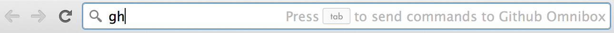
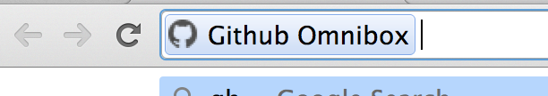
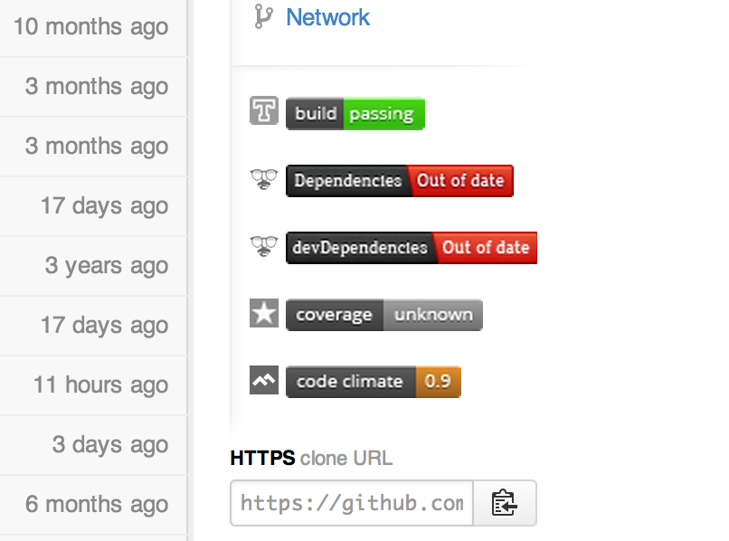

Github-Omnibox
==============

Github Launch for your Google Chrome Omnibox (search box)

Go to the options screen and add your Github credentials for personalized autocompletion

Features
--------

* Address Bar Searching
  Type `gh` and press space or tab to trigger:   
  And when you see this the shortcuts below will work: 
  * Shortcuts
    * Repo Shortcuts
      * Owner's Repo: `gh [owner]/[repo]`
      * My Repo: `gh /[repo]`
      * Repo-Specific Shortcuts
        * Use any repo shortcut or suggestion and add: ` [shortcut]`
        * Currently open webpage's repo: `gh ![shortcut]`
    * User Shortcuts: `gh @[user] [shortcut]`
    * Gist Shortcuts
      * Go to a gist: `gh gist [id]`
      * Go to a user's gist: `gh gist [user]/`
    * My Shortcuts: `gh my [shortcut]`
  * Powered Suggestions
    * Suggest user/org repos: `gh [user-org]/[repo-name]`
    * Suggest user gists: `gh gist [user]/[gist-id]`
  * Personalized Suggestions
    * Authenticate with Github (if you haven't already): `gh my auth`
    * Suggest starred repos: `gh *[repo-name]`
    * Suggest owned repos: `gh /[repo-name]`
    * Suggest followed users: `gh @[user-name]`
    * Suggest owned gists: `gh gist /[gist-id]`
* Url to **gh-pages** if the branch exists but the project url doesn't
* Build Status and Dependency Status Bars  

  * TravisCI - Continuous Integration (Build Status)
  * DavisDM - Dependencies
  * Gemnasium - Dependencies
  * Coveralls - Code Coverage
  * Code Climate - Code Coverage